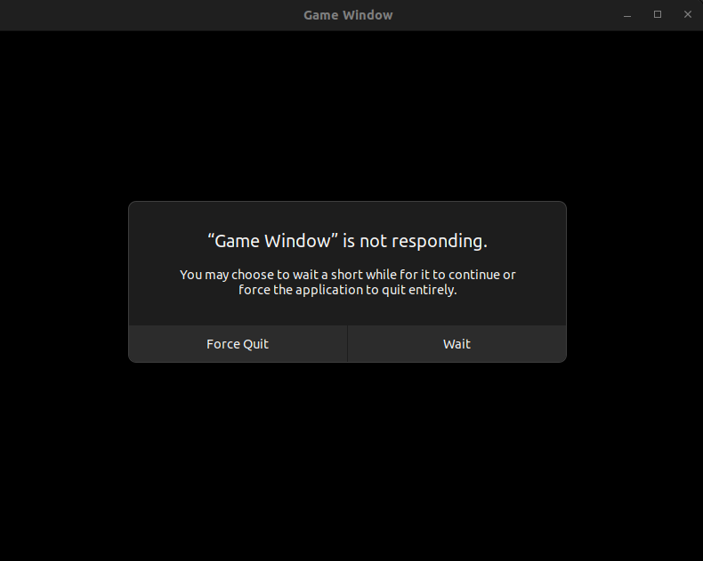
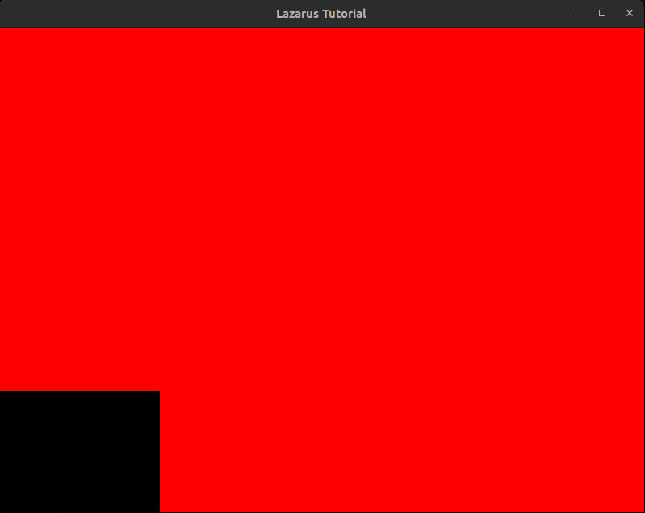
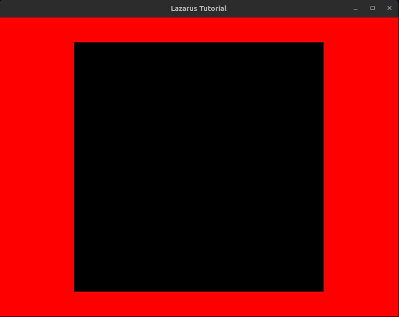

*Work in progress: Check back again soon!*

# Lazarus by Example:
Welcome to the examples guide. While the following was written in a Linux environment, the snippets below have been tested on Windows 10 and MacOS. \
This guide covers the following:
1. [The application window](#window-context)
2. [Configuration](#global-settings)
3. [Loading mesh](#mesh-assets)
4. [Shader Workflow](#shaders)

## Application window:
### Creating a window:
Before we can start drawing any graphics, we need somewhere to draw to. Generally speaking, one of the first things you will want to do is create an application window. Lazarus makes this process simple. Consider the following:
```cpp
#include <lazarus.h>

int main()
{
    //  Instantiate the window object
    Lazarus::WindowManager window("Lazarus Tutorial", 800, 600);
    window.createWindow();

    //  Load user settings from global state
    window.loadConfig();

    // Invoke render loop
    window.open();
    
    while(window.isOpen)
    {
        std::cout << "Window is open!" << std::endl;
    };

    return 0;
}
```

Remember that at any point we can shutdown the program like so:
```cpp
bool gameOver = false;

while(window.isOpen)
{
    if(gameOver)
    {
        std::cout << "Exiting..." << std::endl;
        window.close();
    };
};
```

### Presenting a frame:
Our program should now compile and launch successfully. \
But this is just a blank screen? Lets try draw something! The simplest draw command we can make right now without any further setup is to change the backbuffer color of our window, so lets do that.

```cpp
bool gameOver = false;
float count = 0.0;

while(window.isOpen)
{
    count += 0.001;
    window.setBackgroundColor(count, count / 2.0, count / 5.0);

    if(gameOver)
    {
        std::cout << "Exiting..." << std::endl;
        window.close();
    };
};
```
But nothing's happening!? \
This is because Lazarus uses double buffering, meaning that while frame 'A' is being presented, frame 'B' is being drawn to. To ensure our frames are being swapped accordingly we need to call the following somewhere inside our render loop. Usually at the end of this cycle's operations.

```cpp
window.presentNextFrame();
```

At this point your application may start recieving messages from the OS such as the one in the image below. Don't worry - this is normal, as our application does not yet have anything to respond *to.* We'll remediate this in the next section which looks at how Lazarus manages events. \


### Managing events:
Events in Lazarus are intrinsically tied to the window context in which they were created and dispatched. The window object in question will inherit an `EventManager` interface, which uses callbacks to retrieve information from the programs event loop asynchronously without blocking the application's control flow. 

The lazarus callback functions are abstracted in userspace, taking the form of event-listeners such as the one below.
```cpp
//  Initialise the window's event manager
window.eventsInit();

while(window.isOpen)
{
    //  Listen for events
    window.monitorEvents();
    
    //  Retrieve and use window state
    float red = static_cast<window.mousePositionX> / 100.0;
    float blue = static_cast<window.mousePositionY> / 100.0;

    window.setBackgroundColor(red, 0.0, blue);

    if(gameOver)
    {
        std::cout << "Exiting..." << std::endl;
        window.close();
    }
    else
    {
        window.presentNextFrame();
    }
};
```

Your application should now blend from varying shades of pink, purple and blue depending on the cursor's screen position. \
Our problem from the window creation section should now be resolved, as our application successfully responds to defined inputs.

Next let's try listen for a key event and use it to close our window. We can do so by fulfilling our `gameOver` condition.
```cpp
while(window.isOpen)
{
    //  Listen for events
    window.monitorEvents();
    
    //  Retrieve and use window's cursor location
    float red = static_cast<window.mousePositionX> / 100.0;
    float blue = static_cast<window.mousePositionY> / 100.0;

    //  Check the window's keypress state
    if(window.keyEventCode > 0) gameOver = true;

    window.setBackgroundColor(red, 0.0, blue);

    if(gameOver)
    {
        std::cout << "Exiting..." << std::endl;
        window.close();
    }
    else
    {
        window.presentNextFrame();
    };
};
```

See the [Window API Reference](./api-reference.md#windowmanager) for more information.

## Global Settings:
### Modifying the Lazarus state:
Lazarus keeps track of user settings via the `Lazarus::GlobalsManager` class. This class provides functionality to get and set the state of internally tracked and externally declared Lazarus configuration variables. User settings *must* be specified prior to calling `Lazarus::WindowManager::loadConfig()`. For example:
```cpp
Lazarus::GlobalsManager globals = Lazarus::GlobalsManager();

//  Correct usage: the program will render frames as quickly as possible despite the monitor's maximum refresh rate.
globals.setVsyncDisabled(true);
window.loadConfig();
//  Incorrect usage: The value returned by globals.getLaunchInFullScreen() will reflect your selection, but will be inefective.
globals.setLaunchInFullscreen(true);
```

Find a full list of settings functions [here](./api-reference.md#globalsmanager).

## Mesh assets:
### Hello Quad!
Now that we have a window open, let's render some geometry. To view geometry on screen we need some place to view *from*, this is our camera. \
For now we'll use an orthographic camera which projects the scene into two dimensions devoid of perspective. The orthographic camera observes the scene relative to the pixel dimensions of the viewing plane, these are the dimensions of your application window x2. We're also going to link the Lazarus default shader program, don't worry too much about this right now as it will be covered later in [Shaders](#shaders).

```cpp
#include <lazarus.h>

int main()
{
    //  Engine state interface
    Lazarus::GlobalsManager globals = Lazarus::GlobalsManager();    

    //  Window
    Lazarus::WindowManager window("Lazarus Tutorial");
    window.createWindow();
    window.setBackgroundColor(1.0, 0.0, 0.0);
    window.loadConfig();

    //  Default shader
    Lazarus::Shader shader = Lazarus::Shader();
    int shaderID = shader.compileShaders();
    shader.setActiveShader(shaderID);

    //  Camera
    Lazarus::CameraManager cameraManager = Lazarus::CameraManager(shaderID);
    Lazarus::CameraManager::Camera camera = cameraManager.createOrthoCam(
        globals.getDisplayWidth(), 
        globals.getDisplayHeight()
    );
```

Now lets create our geometry:
```cpp
    Lazarus::MeshManager meshManager = Lazarus::MeshManager(shaderID);
    //  Orthographically viewed, sizing corresponds to pixel-width
    Lazarus::MeshManager::Mesh quad = meshManager.createQuad(
        500,
        500
    );
```

The active shader has been set and our resources are prepared. From here we can begin our render loop, where per-frame we will load our scene's data onto the GPU and use our shader to render the output upon each draw call. Then we present the next frame to observe the outcome.
```cpp
    //  Set background color so quad is visible
    window.setBackgroundColor(1.0, 1.0, 1.0);
    window.open();
    window.eventsInit();

    while(window.isOpen)
    {
        window.monitorEvents();

        //  Load resources
        cameraManager.loadCamera(camera);
        meshManager.loadMesh(quad);

        //  Draw next frame
        meshManager.drawMesh(quad);

        //  Check errors
        int status = globals.getExecutionState();
        if(status != LAZARUS_OK)
        {
            window.close();
        }
        else
        {
            window.presentNextFrame();
        }
    }

    //  Exit
    return 0;
};
```

You should see something like this: congratulations - you've just drawn your first "scene" with Lazarus. \


### Transforming assets:
*But why is it all the way down there?* Because under observation of our orthographic camera, metrics are taken in pixel dimensions from the bottom-left corner of the viewport. Although it may be confusing in this context, it might make sense a little later if you are looking to create UI or HUD components. This is the same coordinate system that is used internally for the layout of text and glyphs. \
To fix the issue; lets center our quad using a transform.
```cpp
    Lazarus::MeshManager meshManager = Lazarus::MeshManager(shaderID);
    Lazarus::MeshManager::Mesh quad = meshManager.createQuad(
        500,
        500
    );

    // After creating the quad, move it to the center of the screen
    Lazarus::Transform transformer = Lazarus::Transform();
    transformer.translateMeshAsset(
        quad, 
        static_cast<float>(globals.getDisplayWidth()) / 2.0, 
        static_cast<float>(globals.getDisplayHeight()) / 2.0, 
        0.0
    );
```
    
Here it is! You'll also observe that the geometry was partially clipped. With the quad centered we can now see it in full. \


For more on this; see the [Mesh section of the API Reference](./api-reference.md#meshmanager).

## Shaders:
### Getting started with shaders:
Shader programs executed on the graphics processor are deterministic of the render result as seen on-screen. Responsible for operations like interpretting geometric data relative to the viewport (vertex shader) to computing the final output color on a per-pixel basis (fragment shader). \
To draw anything to the screen at all, we need to upload our shader program to the GPU. For now we'll look at linking the Lazarus default shader program, how to use your own is covered in the next section.

### Using your own shaders:
Shaders submitted to and compiled by Lazarus should be written in GLSL at version **410**. \
When you submit your own fragment and / or vertex shaders with a call to `Lazarus::Shader::compileShaders()`, there are a number of layout positions, as well as; sampler and uniform names reserved by Lazarus. These variables are accessible in any of your own shader programs and are listed below.

#### Vertex shader inputs:
Note these inputs can be found at `LAZARUS_DEFAULT_VERT_LAYOUT`.
```c
layout(location = 0) in vec3 inVertex;      //  Input Vertex position
layout(location = 1) in vec3 inDiffuse;     //  Input Vertex color
layout(location = 2) in vec3 inNormal;      //  Input Vertex normal
layout(location = 3) in vec3 inTexCoord;    //  Input UV (S/T & stack-index)

uniform int usesPerspective;                //  Which projection type to use, 1 for perspective - otherwise orthographic
uniform mat4 modelMatrix;                   //  The render subject's modelmatrix
uniform mat4 viewMatrix;                    //  The camera's viewing matrix
uniform mat4 perspectiveProjectionMatrix;   //  A 3D projection matrix (if one is present)
uniform mat4 orthoProjectionMatrix;         //  A 2D projection matrix (if one is present)

out vec3 fragPosition;                      //  Output position
out vec3 diffuseColor;                      //  Output color data
out vec3 normalCoordinate;                  //  Output normal coordinates
out vec3 textureCoordinate;                 //  Output UV for render subject
out vec3 skyBoxTextureCoordinate;           //  Output for skybox UV

flat out int isUnderPerspective;            //  Output required by default program for rendering text / glyphs
```

#### Pixel / Fragment shader inputs:
Note these inputs can be found at `LAZARUS_DEFAULT_FRAG_LAYOUT`. \
Anything not used from here will be optimised-out when compiled.
```c
    #define MAX_LIGHTS 150                          

	const int CUBEMAP   = 1;                        //  Storage variants used for comparison with samplerType
	const int ATLAS     = 2;
	const int ARRAY     = 3;

    in vec3 fragPosition;                           //  Input 3D fragment position
    in vec3 diffuseColor;                           //  Input fragment color
    in vec3 normalCoordinate;                       //  Input fragment normals
    in vec3 textureCoordinate;                      //  Input UV coordinates 
    in vec3 skyBoxTextureCoordinate;                //  Input UV coords for skyboxes

    flat in int isUnderPerspective;                 //  1 if a perspective camera is being used to observe this fragment, otherwise 0

    uniform int lightCount;                         //  The number of lights currently bound to lazarus
    uniform vec3 lightPositions[MAX_LIGHTS];        //  A container of 3D light positions in-order
    uniform vec3 lightColors[MAX_LIGHTS];           //  A container of light color values in-order
    uniform float lightBrightness[MAX_LIGHTS];      //  A container of light brightness variables in-order

    uniform vec3 fogColor;                          //  The color of environmental fog if it is present
    uniform vec3 fogViewpoint;                      //  Where the epicenter from which fog thickness attenuates out from
    uniform float fogMaxDist;                       //  The maximum distance at which environment fog effects are observable
    uniform float fogMinDist;                       //  The minimum distance at which environment fog effects are observable
    uniform float fogDensity;                       //  Thickness of environment fog if present

    uniform vec3 textColor;                         //  The color of the text, if the fragment is part of an ascii glyph

    uniform int samplerType;                        //  In-storage variant for identification of texture samplers
    uniform int discardFrags;                       //  Whether or not fragments with a diffuse-alpha value of zero should be discarded.

    uniform sampler2D textureAtlas;                 //  Glyph atlas used for font bitmaps
    uniform sampler2DArray textureArray;            //  Array sampler / testure stack
    uniform samplerCube textureCube;                //  Cubemap sampler used for skyboxes

    out vec4 outFragment;                           //  The output fragment color

    vec4 _lazarusComputeColor();                    //  Evaluate inputs and determine fragment's rgba values
    vec3 _lazarusComputeLambertianReflection();     //  Calculate the fragment's diffuse lighting
    float _lazarusComputeFogFactor();               //  Calculate fog attenuation
```